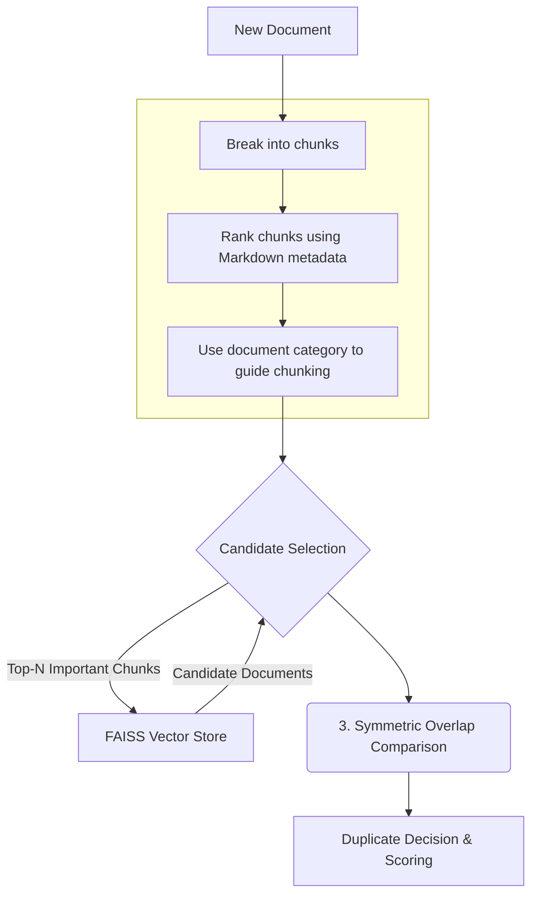
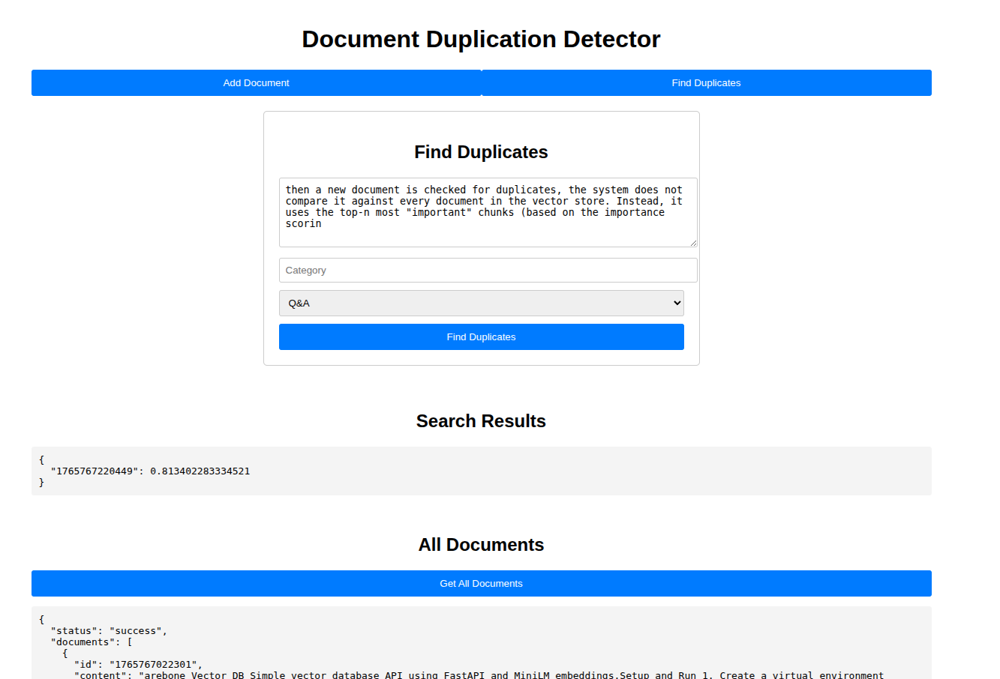

# doc_dup_det: Prototype Duplicate Detection Service
This prototype detects potential duplicate content using embeddings and similarity comparison. It is served as an API using **FastAPI**, fully **dockerized**, and uses **FAISS** as the vector store for simplicity.

## Design Philosophy
My approach with this prototype was to build a functional foundation for duplicate detection while also introducing concepts that could be elaborated on in future iterations. Some design decisions are based on experience with similar systems and are intended to be starting points for further discussion and refinement.

## Duplicate Detection Process

### 1. Optimized Inference and Chunking
The service first breaks down documents into smaller chunks. This process is guided by a metadata-based rule system for faster processing.

- **Metadata for Re-ranking:** Metadata related to markdown formatting (e.g., `#` for headers, `*` for bold text) is used to re-rank newly created document chunks. For longer documents, this allows the system to focus on the most important chunks based on a weighted sum of these special characters, assuming that more formatting indicates higher relevance.
- **Dynamic Chunk Sizing:** The service uses the `category` of a document (e.g., "qna", "user_guide") to dynamically adjust chunk sizes. The intention was to introduce the concept that different types of content might be chunked more effectively with different sizes (e.g., smaller chunks for Q&A, larger for user guides). This is a concept that can be explored and validated further based on the use case.

### 2. Candidate Selection
When a new document is checked for duplicates, the system does not compare it against every document in the vector store. Instead, it uses the top-n most "important" chunks (based on the importance scoring from the previous step) to quickly find a smaller set of *candidate* documents. This significantly reduces the search space, making the process more efficient.

### 3. Symmetric Overlap Comparison
Once a list of candidates is identified, a custom symmetric overlap function is used as a second filter. This function evaluates whether the candidate documents are truly similar across their entirety, not just a single chunk. This ensures that a small portion of matching content **does not falsely label two documents as duplicates**, providing a more accurate, document-level similarity judgment and reducing false positives.

## Process Diagram


## API Response and Scoring
The API returns a list of top-k documents with corresponding similarity scores. Currently, the service does not perform any explicit filtering based on these scores. The intention was to first build the core detection logic, with the assumption that features like score-based filtering would be part of a later fine-tuning and product discovery process.

## Potential Improvements
- **Score-based Filtering:** Implement a configurable threshold for similarity scores to automatically filter results and classify documents as duplicates.
- **Modular Chunking Rules:** Make the metadata-based chunking logic modular per use case, category, or format.  
- **Benchmarking:** Benchmark different chunking and embedding strategies during document registration to find the most optimal approach.  
- **Advanced Indexing:** Evaluate indexing strategies per document type and consider guided summarization for faster retrieval.  

## Assumptions
- Using **FAISS** as the vector store (with its current limitations).  
- Content types assumed: **Q&A, blog posts**.  
- Document format assumed: **Markdown (MD)**.  

## Getting Started

### Requirements
- Python 3.10+  
- Docker (for containerized deployment)  

### Running Locally
1. Clone the repository:  
   ```bash
   git clone <repo-url>
   cd <repo-folder>
   ```
2. Create .env file:
   - Create a `.env` file from the `.env.example` and add your OpenAI API key:
     ```bash
     cp .env.example .env
     # Add your OpenAI API key to the .env file
     ```

3. Build and run using Docker Compose:

  ```bash
  docker compose -f docker-compose.yml up --build -d
   ```
4. Access the the playground at: http://localhost:8000 

## Playground


